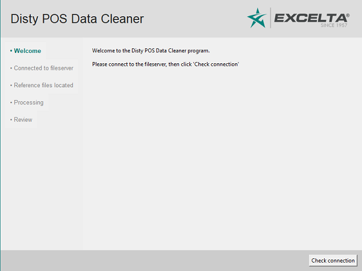
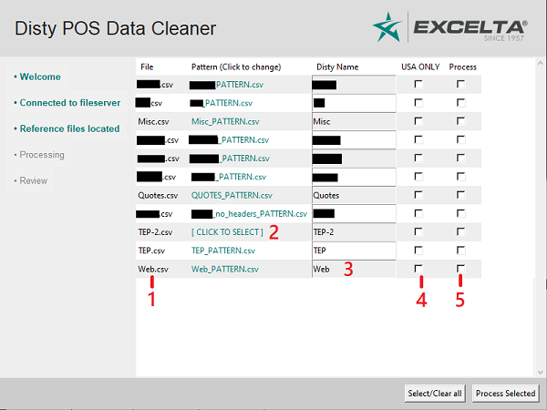

# Disty POS Data Cleaner `pos-data-cleaner`

*This single-file Python program was created to take in a raw Point of
Sale (POS) report from a distributor, process and format the data
according to Excelta's guidelines, and output a .csv file that can be
added to the monthly MOSALES spreadsheet.*

> **Note**: This is a **public repository**, but the POS Data Cleaner is
> designed to process **proprietary information**. Company and customer
> information must not be included in this program or its documentation.

#### Table of Contents
  - [Program overview](#program-overview)
  - [Running the program](#running-the-program)
    - [Download](#download)
    - [Running as an .exe](#running-as-an-.exe)
    - [Running from source](#running-from-source)
    - [Set up parameters](#set-up-parameters)
  - [How to use the data cleaner](#how-to-use-the-data-cleaner)
  - [Supporting files](#supporting-files)
    - [Pattern files](#pattern-files)
      - [Column Names and Header Rows](#column-names-and-header-rows)
      - [City and St(ate)](#city-and-state))
      - [Cost and Ext calculation](#cost-and-ext-calculation)
      - [Disty target row](#disty-target-row)
      - [Strip String](#strip-string)
- [Making Changes](#making-changes)
  - [Compiling a new executable file](#compiling-a-new-executable-file)

## Program overview
This program is written in a single Python file, `cleaner.pyw`. When
executed, the program connects to the Excelta fileserver where it
retrieves updates to its reference files. It will then allow the user to
select one or more raw data files to process and, upon completion, save
a properly formatted file to the fileserver.

## Running the program
This program has historically been packaged as an .exe file and zipped
together with its subdirectories for distribution to Excelta users. This
ensures that all prerequisites are included in the file. To use the
program, first download it with the link provided below, then unzip it
to any location on your hard drive and run `cleaner.exe`.

*Please note that Windows will likely consider an application like this
to be potentially dangerous. You will likely need to tell Windows to
"Run Anyway" when it blocks execution of the app. This should only occur
once.*

### Download
|[Download the latest release](https://github.com/excelta-corp/pos-data-cleaner/releases)|
|---|

There is a backup version of the binary and source code from October
2019
[located on SharePoint](https://excelta.sharepoint.com/:f:/s/ExceltaSacramento/Eh7gDVaNz9ZOrtkvfU88hx4BtuJfsbMq9bRtarpM6zLzow?e=6f4rmC).

### Running as an .exe
If you are on a Windows machine, simply run the cleaner.exe file as
normal.

### Running from source
>Unless you need to run the program from source, please skip ahead to
>the [set up parameters](#set-up-parameters) section.
 
If you would like to run `cleaner.py` from source, you will need to
[install Python 3](https://www.python.org/), then use the package
manager to [install Pandas](http://pandas.pydata.org). The other modules
that the program uses, `tkinter`, `os`, `re`, `glob`, `time` and
`datetime` are all included in the Python Standard Library and do not
require separate installation.

### Set up parameters
Regardless of whether the program is run in Python or as an executable
in Windows, a few parameters need to be set up. 

First, open the `config.ini` file using Notepad and examine the first
five file paths for "critical fileserver locations" inside.

```
fileserver_path_root        = //221.21.21.6/Sales/Rep Com/2019/Raw Data Formatting
fileserver_path_reference   = //221.21.21.6/Sales/Rep Com/2019/Raw Data Formatting/reference
fileserver_path_patterns    = //221.21.21.6/Sales/Rep Com/2019/Raw Data Formatting/patterns
fileserver_path_input       = //221.21.21.6/Sales/Rep Com/2019/Raw Data Formatting/input
fileserver_path_output      = //221.21.21.6/Sales/Rep Com/2019/Raw Data Formatting/output
```

As you can see, these paths are pointing towards the `Sales/Rep
Com/2019/Raw Data Formatting` folder on the Filesever and its four
sub-folders called **reference**, **patterns**, **input**, and **output**. Here's
what each of those folders is for:

* The **reference** folder contains specific files that the program uses
  to cross-reference the data it finds in the raw files. This folder
  must contain both of the following:
  
  |File Name|Description|
  |---|------|
  |`state_abbreviations.csv`|This is a simple reference that allows the program to recognize a state name in addition to its two-letter abbreviation. E.g. "Florida" will work as well as "FL"|
  |`zip3_to_st_str.csv`|This spreadsheet matches the first three numbers of each US zip code to its city and state to help confirm that a five-digit zip code is in the USA.|

> More on the functionality of these files [here](#why-do-we-need-the-state-for territory parsing).

  Make sure the `fileserver_path_reference` path points to a folder
  containing these two files.
* The **patterns** folder contains a group of small files typically
  ending in `_PATTERN.csv`. These are created for each distributor and
  help the program map raw data to the correct values.
  
  Make sure the `fileserver_path_patterns` path points to a folder where
  these pattern files can be found. More info on pattern files can be
  found [here](#pattern-files).
* The **input** folder is where we'll put the raw data files that are
  ready to be processed.
* The **output** folder is where the program will create the finished,
  formatted POS files.

There are two more specific file paths included in this folder which
locate the zip code and product lookup tables: 
``` 
zip_fs_path                 = //221.21.21.6/Sales/Rep Com/2019/Zip Code Lookup Table.csv
prod_fs_path                = //221.21.21.6/Sales/Rep Com/2019/Product Lookup Table.csv
```
The **Zip Code Lookup Table** is a living reference document that
associates zip code ranges with sales territories. Make sure the
`zip_fs_path` leads to the master document.

The **Product Lookup Table** is a living reference document that
associates Group and Category information with our stock codes. Make
sure the `prod_fs_path` leads to the master document.

> Please note that all the files that the Data Cleaner interacts with
> should be UTF-8 CSV files, including these reference files.

## How to use the data cleaner
Below is a short walkthrough of using the POS Data Cleaner to format raw
POS data from one or more distributors that are already set up.
1. Make sure you have the latest version of the data cleaner
   [downloaded](#download) and unzipped to a folder on your PC, and that
   you have [set up the file paths](#Set-up-parameters) in `config.ini`
   correctly.
2. Connect to the Fileserver
3. Open the raw data file you received from the distributor.
   *  Make sure it looks the same as it did last month - changes to the
      report format could cause the processing to fail. If the report
      has changed, go to
      [setting up a new distributor](docs/Setting%20up%20a%20new%20distributor.md). 
   *  Assuming it all looks good, save it to the `fileserver_path_input`
      directory as a UTF-8 .csv file, preferably using the usual Disty
      name. For example, if we're getting the file from Moon Tool, we'd
      likely name it `Moon Tool.csv`
4. Run `cleaner.exe`. In a moment, the following GUI should appear.

   
5. Click "Check Connection" and the program will detect a connection to
   the Fileserver and, if successful, ask you to click "Continue" to
   verify the presence of necessary reference files.
6. Click "Continue" to cue the program to find the reference files
   specified in `config.ini`. When they are successfully found, it will
   prompt you to click "Continue" again.
7. Now, you should see a table appear.

   
   
   - In the File column, you can find each .csv file in the input
     folder. (1)
   - In the Pattern column, you can select from any of the available
     pattern files in the pattern folder. 
     
     The program will try to match them automatically (e.g. it will
     default to `Moon Tool_PATTERN.csv` if it finds `Moon Tool.csv`). If
     the program can't find an easy match, it will prompt you to \[
     CLICK TO SELECT \] a pattern file (2).
   - The Disty Name column will also default to the name of the input
     file. Type a different name in this field to change the Disty name.
     (3)
   - The USA ONLY checkbox (4) is very situational and should **only**
     be used if two conditions are met:
     1. The raw data file **must be missing a State field**.
     2. **Every single item** in the raw data file must have been sold
        to a customer **in the USA**.
        
     Having no State field would typically prevent any automatic
     territory matching from happening, because the program needs the
     State to confirm that a Zip code is USA-based. However, checking
     this box overrides this confirmation and assumes that all zip codes
     are USA zip codes.
     
     **This can save a lot of time, but it can also generate false
     positives. Use with care!**
     
   - Check the Process checkbox (5) to indicate that this file is to be
     processed in the next batch. You can also use the "Select/Clear
     all" button at the bottom to save time.
8. Click "Process Selected" to begin processing the raw data files using
   the chosen pattern files. You will see a progress bar and a list of
   the chosen files. This list will update with "Complete" or, in case
   of failure, a specific failure message.
9. The program will announce that it has finished. At this point, you
   can either close the program or press the "Return to file chooser"
   button to select more files for processing.
10. Finally, go to the output folder and confirm that the desired files
    have been created. Open these files and make sure there are no
    missing Group or Category fields, or blank Territory values.

Any missing Group or Category fields are almost certainly caused by an
incorrect part number which defies the program's attempt to
cross-reference with our stock codes. Fixing the erroneous part numbers
in the raw file and re-running should solve this problem

## Supporting files
This section describes a few of the directories and files that the Disty
POS Data Cleaner interacts with.

### Pattern files
Each of these files acts as a map to translate a typical raw file from
each distributor to the desired format.

>For a more in-depth look at pattern files, see the 
>[setting up a new distributor](docs/Setting%20up%20a%20new%20distributor.md) page.

Each pattern file is a UTF-8 .csv file that ends with `_PATTERN.csv` and
usually begins with a distributor's name. These files all have nine
total rows and only three columns.

Here's what one might look like:

Target|Source|Strip String
------|------|------------
Customer|CustomerName|
City|ShipCity|
St|St|
Zip|ShipZip|
Item|Material|-EXC
Qty|ActlInvQty|
Cost||
Ext|TotalCost|
Disty||

Every pattern file has the same Target fields, and correspond to many of
the columns of a cleaned POS file. The Source values correspond to the
relevant columns in the raw data file.

In the above example, the distributor keeps the City data for each
transaction in its ShipCity column, so we add that as the Source for our
City column.

#### Column Names and Header Rows
In the above example, the first row of our raw data table is used for
column names. However, certain distributors send files where the first
row is a title of some kind, blank, or otherwise useless.

**If the first row of the raw data is not entirely column headers, the
source column should instead use Excel column letters, as below:**

Target|Source|Strip String
------|------|------------
Customer|E|
City|C|
St|D|
Zip|G|
Item|A|-EXC
Qty|H|
Cost||
Ext|J|
Disty||

#### City and St(ate)
Many countries other than the USA use a five-digit zip code. In order to
confirm that a given zip code belongs in the USA and can use our Zip to
Territory reference files, the program will try to use the State
information to confirm that a zip code is American.

> If there is no St column in the raw data, the program will have no way
> of telling whether a zip code is American, and most territories will
> be blank as a result.

##### Why do we need the State for territory parsing?
The following table is using correct postal codes:

City|State|Zip
----|-----|---
Janzé|Bretagne|35150
İzmir|İzmir|35150
Ciudad Lerdo|Durango|35150
Taladega Springs|AL|35150
Taladega Springs|Alabama|35150

**Janzé in France, İzmir in Turkey, Ciudad Lerdo in Mexico, and Taladega
 Springs in Alabama all use zip code 35150.** 
 
When the parser comes across any non-Canadian
  zip code, it uses the `zip3_to_st_str.csv` file to determine that zip codes
   starting with 351 belong in the state of Alabama, and checks the St column
    to test each field.
   
Bretagne, İzmir, and Durango fail that test and are assigned international
 territories, while AL and Alabama (synonymous thanks to `state_abbreviations.csv`), 
 pass the test and are assigned our USA territory for that region.
 
>If the USA ONLY checkbox was checked on this file, the lines bound for France, 
>Turkey and Mexico would all be assigned our Alabama territory.

#### Cost and Ext calculation
Note that there is no data for the Cost column in the above example;
this is acceptable as the Cost can be calculated from the Ext and Qty
values. Likewise, Ext could be blank if we have Cost and Qty.

#### Disty target row
The last row, Disty, exists for the rare cases when we have one POS file
containing multiple distributors, and where we have a column in the raw
file that we can map to distributor names. In most cases, this row will
be blank or absent.

#### Strip String
The final column is used to edit the values of each column during
processing. Anything typed in the Strip String box will be removed from
the Source before being passed to the Target.

In this example, the distributor is adding -EXC to the end of all of our
part numbers, which would prevent them from being cross-referenced. By
adding `-EXC` to the Strip String, `9241E-EXC` becomes `9241E`.

For more on Strip String functionality, view [setting up a new distributor](docs/Setting%20up%20a%20new%20distributor.md).

**The Strip String fields have no effect on Zip, Qty, Cost, or Ext.**

# Making Changes

*This section is in progress* 

## Compiling a new executable file
Please refer to
[creating a binary with PyInstaller](docs/Creating%20a%20binary%20with%20PyInstaller.md)
for more information.
