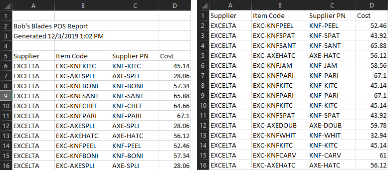

# Setting up a new distributor
Are you looking to set up a brand new distributor, adjust to a new
 POS report format, or investigate an error? This
 document will help by providing a step-by-step setup process with an in-depth 
 look at how pattern files work.
 
> This document will prompt you to save files in specific locations (e.g. the
> "input" or "patterns" directory). Refer to the section on [setting up parameters](../README.md#set-up-parameters) in the Readme to
> learn more about these locations.
 
## For example
Let's say we're a leading manufacturer of quality bladed instruments—namely
, knives and axes. We have recently started distributing our fine products
 through **Bob's Blades** and have received our first POS report.
 
First, let's take a look at our own product information:

## Our catalog
Here's a sample of our hypothetical products:

Stock Code|Description|Price|Group|Category
---|---|---|---|---|
KNF-CHEF|Chef's Knife|$53.00|Kitchen|Knife
KNF-PARI|Paring Knife|$55.00|Kitchen|Knife
KNF-UTIL|Utility Knife|$65.00|Kitchen|Knife
KNF-SANT|Santoku|$54.00|Kitchen|Knife
KNF-BONI|Boning Knife|$47.00|Kitchen|Knife
KNF-BREA|Bread Knife|$59.00|Kitchen|Knife
KNF-CLEA|Cleaver|$35.00|Kitchen|Knife
KNF-STEA|Steak Knife|$35.00|Kitchen|Knife
KNF-PEEL|Peeler|$43.00|Kitchen|Knife
KNF-JAM|Jam Knife|$48.00|Kitchen|Knife
KNF-KITC|Kitchen Axe|$37.00|Kitchen|Axe
KNF-SPAT|Spatula|$36.00|Kitchen|Knife
KNF-CARV|Carving Fork|$50.00|Kitchen|Knife
KNF-WHIT|Whittling Knife|$27.00|Timber|Knife
AXE-SPLI|Splitting Maul|$23.00|Timber|Axe
AXE-SCAN|Scandanavian Axe|$28.00|Timber|Axe
AXE-HATC|Splitting Hatchet|$46.00|Timber|Axe
AXE-HUNT|Hunter's Axe|$38.00|Timber|Axe
AXE-DOUB|Double Axe|$49.00|Timber|Axe
AXE-FELL|Felling Axe|$27.00|Timber|Axe
AXE-CARP|Carpenter's Axe|$43.00|Timber|Axe

The table above would be similar to our **Product Lookup Table** reference
 document, which is used to associate a given Stock Code with a Group and
  Category.
  
## Looking at Bob's POS Report
The report we get from the distributor is called the "raw data" for the
 purposes of this documentation. As each disty is different, we'll have to
  pay close attention to the details of this document in order to create the
   pattern file.

### Save as CSV UTF-8 to strip formatting
The first thing to do is to open up Bob's POS report in Excel and save it in
 the raw data input folder as
 a UTF-8 CSV file. (The file type will be `CSV UTF-8 (Comma delimited)(*.csv)` in Excel.) Keep spaces, if desired, but remove any other punctuation
  symbols. For example, Bob's Blades would become `Bobs Blades.csv`. 
  
  Once the file has been saved, close Excel and open the CSV file to view the
   data with no formatting.
  
### Headers, or no headers?
All POS files that we receive can be divided into two categories: Those with
 a header row, and those without. Reports that add titles, dates, or blank
  rows to the top of the document are considered to have no headers.
  

In the above example, the document on the left is considered to have **no
 headers**, even though there are column names on row 5. The document on the
  right has column names in its first non-blank row, so it has headers.
  
>Why does this matter? When we're putting together a Pattern file later on, 
>we'll need to refer to columns in this file. If the document has headers, we
>can use the column names. If not, we use letters instead.

### Do we have all the fields we need?
Here are the fields we're looking for:

Data|Required|Note
----|--------|----
Customer|❌|Person or business
City|❌|If available
St|❌|State - highly recommended!
Zip|✔|Postal code, any format
Item|✔|Our part number
Qty|✔|Necessary
Cost|✔|Unnecessary if we have Ext
Ext|✔|Unnecessary if we have Cost
Disty|❌|Special - see note below

>Note that most POS files won't have a column containing distributor names
> because they're from a single distributor. However, our internal reports
> sometimes combine multiple distributors. If this is the case, we need to have
> a column which includes the distributor names.

If we have the bare minimum of part number, quantity, zip code, and either
 the item cost or the total cost, we're good to go. However, the more of
  these fields we can satisfy (except Disty) the better.

If we do not have these fields, the program will not have enough data to
 proceed and we should find an alternative way to process the file, or
  request more information from the distributor.

## Creating the pattern file
Pattern files are tiny spreadsheets that the program uses to map a column in the 
raw file to a column in the finished file. As long as future POS reports
 follow the same format, you should only need to create one pattern file per
  new distributor.
  
### Create a blank pattern file
Open Excel and type the following exactly:

◢|A|B|C
-----|---|---|---
**1**|Target|Source|Strip String
**2**|Customer||
**3**|City||
**4**|St||
**5**|Zip||
**6**|Item||
**7**|Qty||
**8**|Cost||
**9**|Ext||
**10**|Disty||

When you're done, save this file as a UTF-8 CSV where the other pattern files
 are kept. Set the filename to the raw data filename, followed by `_PATTERN.csv
 `. For example
 , we'd
  save this one as `Bobs Blades_PATTERN.csv`
  
Keep it handy - we'll be right back with it.

### Linking the raw fields
Now, let's look at the first few rows of Bob's POS report.

◢|A|B|C|D|E|F|G|H
-----|---|---|---|---|---|---|---|---
**1**|Item Code|Supplier PN|Cost|Qty Sold|Customer|Ship City|Ship State|Ship Zip
**2**|EXC-KNFCARV|KNF-CARV|61|1|Sebastian Watson|Scarborough|Ontario|M1B 3E3
**3**|EXC-KNFBREA|KNF-BREA|71.98|7|David Allen|Fresno|CA|93706
**4**|EXC-AXEDOUB|AXE-DOUB|59.78|14|Grace Peterson|Pueblo|CO|81003
**5**|EXC-AXESCAN|AXE-SCAN|34.16|8|Matthew Watson|Anadarko|OK|73005
**...**|...|..|...|...|...|...|...|...

You may notice that, in the above version, we **do have headers** because the
 first row contains the column names. As a result, we'll be using the column
  names, not the letters, in the pattern file.
  
> Note that the distributor has included their own part number, in the "Item
> Code" column, whereas our part number is in the "Supplier PN" column. We
> want to use our own part number, to cross-reference with our products table.

Now, we copy the column names from the raw sheet into the "Source" column of the
 pattern file in order to connect the data we want to use.
 
 ◢|A|B|C
-----|---|---|---
**1**|Target|Source|Strip String
**2**|Customer|Customer|
**3**|City|Ship City|
**4**|St|Ship State|
**5**|Zip|Ship Zip|
**6**|Item|Supplier PN|
**7**|Qty|Qty Sold|
**8**|Cost|Cost|
**9**|Ext||
**10**|Disty||

We have left Ext blank, but that's okay because we have Cost and Quantity
, and the program can do the math. Disty is also left blank, as will usually
 be the case.
 
If Bob's Blades had given us a POS file without column names on the first row
, the pattern file would look like this instead:
 
  ◢|A|B|C
-----|---|---|---
**1**|Target|Source|Strip String
**2**|Customer|F|
**3**|City|G|
**4**|St|H|
**5**|Zip|I|
**6**|Item|C|
**7**|Qty|E|
**8**|Cost|D|
**9**|Ext||
**10**|Disty||

At this point, we may be ready to save the pattern file and then 
[run the program](../README.md#running-the-program). On the other hand, it's
 possible that the distributor's system has added characters to a few of
  these values that may disrupt the data cleaner.
  
In that case, we'll need to use column C.

## Using the Strip String
The third column in the pattern file, the Strip String, is used to
 programmatically remove characters from the raw data fields.
 
### Simple Removal
Some distributors add something extra to our part numbers. For example, let's
 say that Bob's Blades had sent us this:
 
◢|A|B|C|D|E|F|G|H|I
-----|---|---|---|---|---|---|---|---|---
**1**|Supplier|Item Code|Supplier PN|Cost|....
**2**|EXCELTA|EKNFCARV|EXC-KNF-CARV|61.00|...
**3**|EXCELTA|EKNFBREA|EXC-KNF-BREA|71.98|...
**4**|EXCELTA|EAXEDOUB|EXC-AXE-DOUB|59.78|...
**5**|EXCELTA|EAXESCAN|EXC-AXE-SCAN|34.16|...
**...**|...|..|...|...|...|...|...|...|...

Our part numbers in the "Supplier PN" column have been altered; `EXC-` has been
 added to the beginning of each part. This prevents the program from
  successfully cross-referencing the product table to acquire the Group and
   Category information. 
 
 Fortunately, we can add the unwanted characters to
    the Strip String cell for this field to have them
    automatically removed:
   
 ◢|A|B|C
-----|---|---|---
**1**|Target|Source|Strip String
**2**|Customer|Customer|
**3**|City|Ship City|
**4**|St|Ship State|
**5**|Zip|Ship Zip|
**6**|Item|Supplier PN|`EXC-`
**7**|Qty|Qty Sold|
**8**|Cost|Cost|
**9**|Ext||
**10**|Disty||

Now, the program will see `EXC-KNF-CARV`, the Strip String will remove `EXC-`, 
and it'll end up processing `KNF-CARV`, which is a positive match for our
 part number and can be cross-referenced.
 
### Multiple terms
In very rare cases, we may need to remove more than one series of characters
 from a field in order to process it. In order to do this, we simply separate
  the terms with a bar character (`|`) - usually typed with `Shift
  ` + `Backslash`. Make sure not to include any extra spaces between the terms!
  
For example, `EXC-KNF-CARV*` would require the Strip String `EXC-|*` in
 order to be changed to `KNF-CARV`. 
 
 First, the `EXC-` is removed, the
  `|` character separates the terms, then the
   `*` character is removed.
 
 >Please note that the terms are removed **in order**, not all at once. This
> means that the order of the terms can be important:
>
>With the Strip String `?|junk`
>
>`WOju?nkRD` → `WOjunkRD` (`?` removed) → `WORD` (`junk` removed)
>
>With the Strip String `junk|?`
>
>`WOju?nkRD` → `WOju?nkRD` (`junk` not found) → `WOjunkRD` (`?` removed)

### Exterminator terms
Sometimes, the series of characters you need to remove aren't always the same. 
This can happen when the distributor adds a numerical code to the end of our
 part number, for example. To deal with these, we can use two angle brackets
  to tell the program to delete everything before or after the term.
  
For example if we got this from Bob's Blades:

◢|A|B|C|D|E|
-----|---|---|---|---|---|
**1**|Supplier|Item Code|Supplier PN|Cost|....
**2**|EXCELTA|EKNFCARV|KNF-CARV_14735|61.00|...
**3**|EXCELTA|EKNFBREA|KNF-BREA_39592|71.98|...
**4**|EXCELTA|EAXEDOUB|AXE-DOUB_98911|59.78|...
**5**|EXCELTA|EAXESCAN|AXE-SCAN_39893|34.16|...
**...**|...|..|...|...|...|...|...|...|...

We could use the strip string `>>_` to delete the underscore character and
 everything following it, returning these part numbers to their original form.
 
### All together now
One of our distributors gives us our part numbers like this:

◢|A|
-----|---|
**1**|vendprod 
**2**|vpd_KNF-CARV Carving fork
**3**|vpd_KNF-BREA Bread knife
**4**|vpd_AXE-DOUB Double axe
**5**|vpd_AXE-SCAN Scandanavian axe
**...**|...|..

While this may seem like a lost cause, the following typed into the Strip
 String field will give us workable part numbers: `>> |vpd_`
 
 Multiple exterminators and regular terms can be strung together, allowing
  you to modify each value to a great degree.
 
### Using strip strings to fix stylized reports
Occasionally, we will receive a POS report that has been formatted or styled in a
 way that the program has trouble parsing. This can be the result of pivot
  tables being used, gaps or headers in the middle of the data, or just a
   fancy report style.
   
The program would trip over this:
 
 ◢|A|B|C|D|
-----|---|---|---|---|
**1**|Supplier|Item Code|Supplier PN|Cost|
**2**|=======|Knives|=======|=======|
**3**|EXCELTA|EKNFCARV|KNF-CARV|61.00|
**4**|=======|Axes|=======|=======|
**5**|EXCELTA|EAXEDOUB|AXE-DOUB|59.78|
**6**|EXCELTA|EAXESCAN|AXE-SCAN|34.16|
**...**|...|..|...|...|

However, we can perform a trick:

 ◢|A|B|C
-----|---|---|---
**1**|Target|Source|Strip String
**2**|Customer|Customer|
**3**|City|Ship City|
**4**|St|Ship State|
**5**|Zip|Ship Zip|
**6**|Item|Supplier PN|`>>=`
**7**|Qty|Qty Sold|
**8**|Cost|Cost|
**9**|Ext||
**10**|Disty||

The program will automatically throw out any row if, after the Strip Strings
 are processed, that row does not have an item number. Since we're mapping
  `Item` to `Supplier PN`, and we're removing the `=======` values from that
   column, we're ensuring that the item numbers in Column C are empty, and
    that rows 2 and 4 are tossed out before processing.
    
## That's all there is to it
You're now definitely ready to 
[run the program](../README.md#running-the-program).

When you're finished, make sure to check the output files to verify that the
 program has done what you expected.